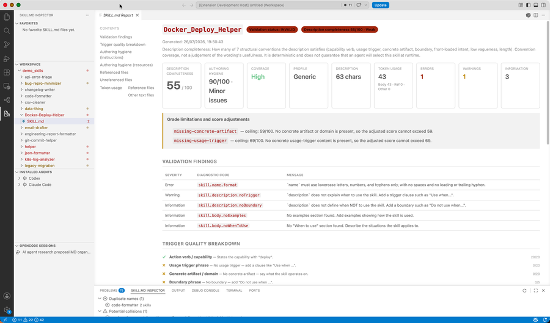
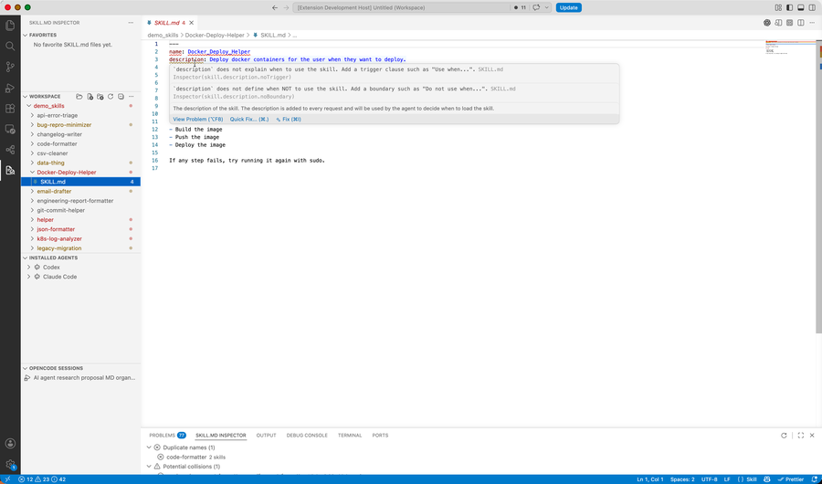
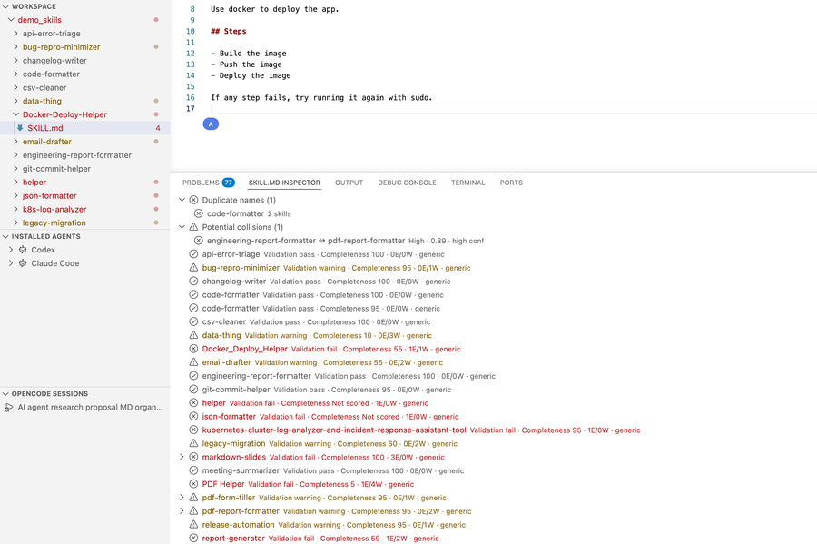
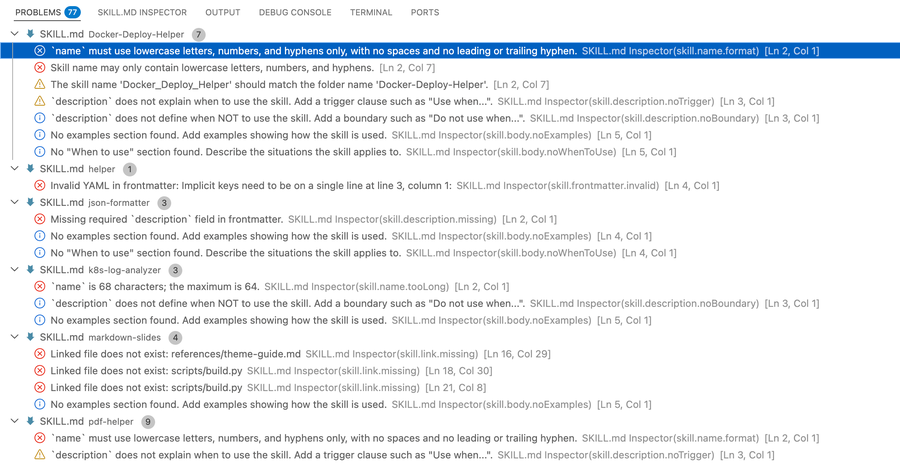
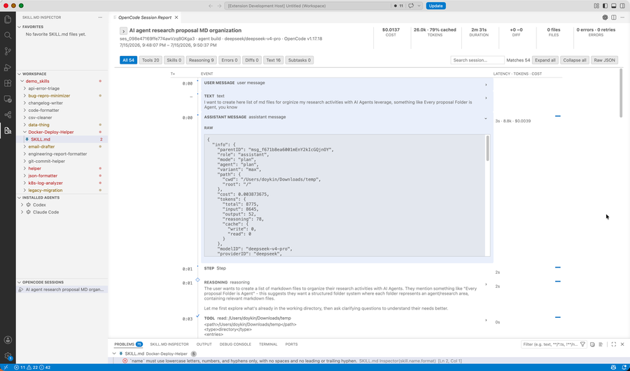
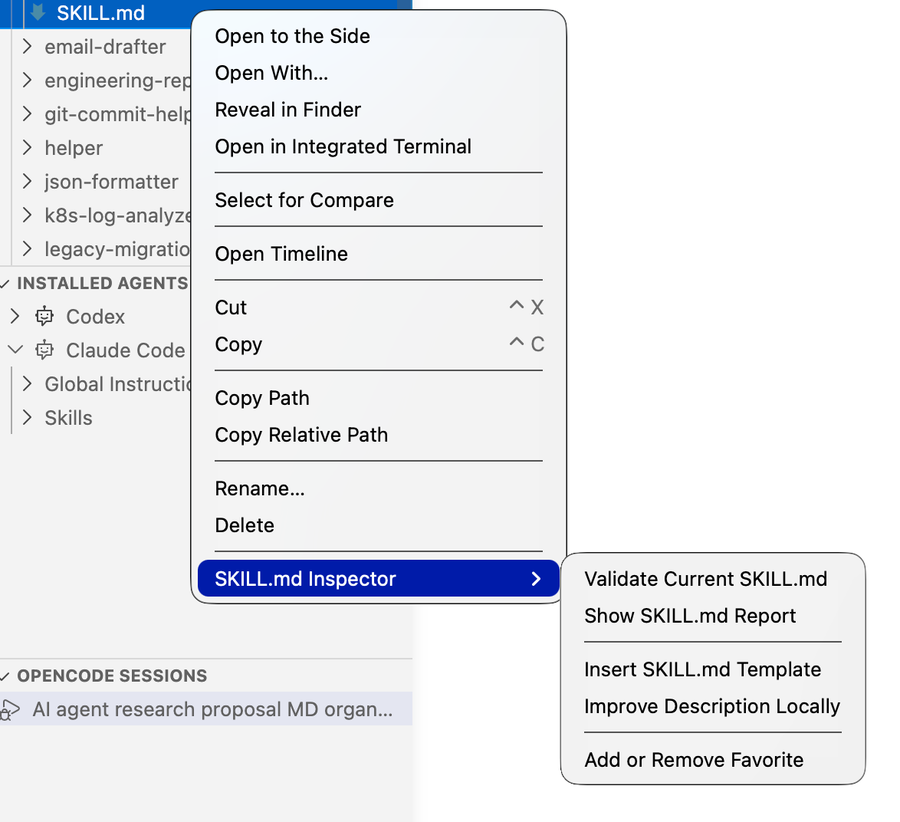
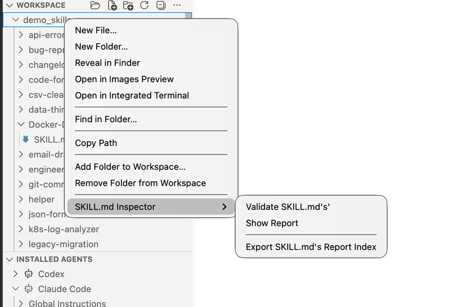
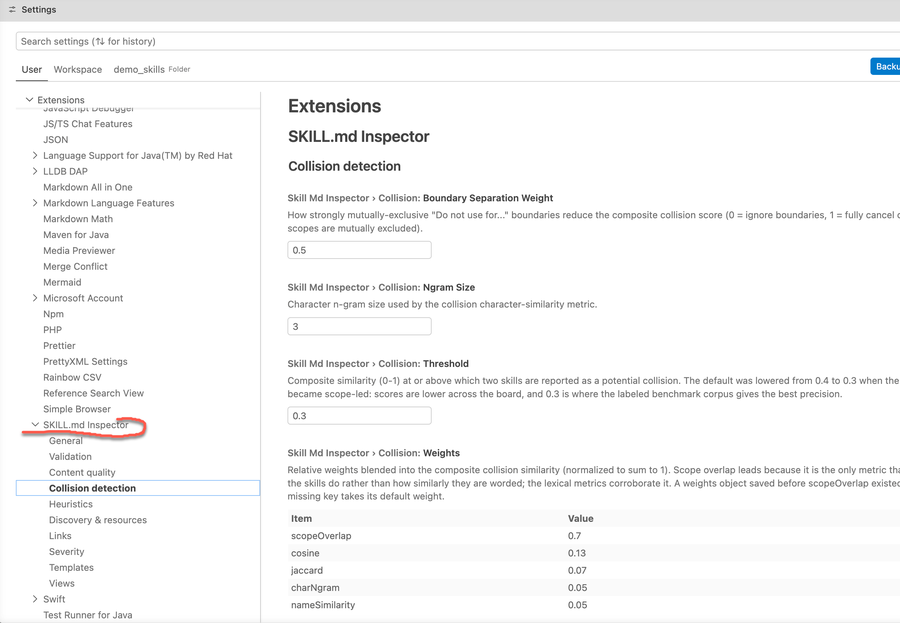

# SKILL.md Inspector

Write, validate, and compare Agent Skills without leaving Visual Studio Code.
SKILL.md Inspector gives every file named exactly `SKILL.md` live feedback,
guided fixes, readable reports, and workspace-wide collision checks.

The extension is offline by default. It does not call an LLM, run an agent,
execute commands from inspected files, or send telemetry. Network access occurs
only when you explicitly enable remote-link availability checks.

## Features

- **Catch invalid skills while you type** — check YAML frontmatter, names,
  descriptions, Markdown links, bundled resources, body structure, and common
  platform compatibility problems.
- **Apply guided fixes** — insert required fields or a starter template, convert
  names to kebab-case, add trigger and boundary clauses, create missing linked
  files, reference untracked resources, and teach the heuristics new vocabulary.
- **Understand what needs attention** — keep specification errors, portability
  warnings, security findings, and optional quality advice clearly separated.
- **Review a complete skill package** — inspect description completeness,
  instruction and resource hygiene, token usage, links, and bundled files in one
  report.
- **Compare a collection of skills** — find duplicate or confusing names, detect
  overlapping scopes, review resource graphs, and export a machine-readable
  `skills.index.json`.
- **Browse skills where your agents keep them** — navigate workspace files, save
  favorites, and discover supported Codex, Claude Code, OpenCode, and GitHub
  Copilot locations.
- **Inspect OpenCode session exports** — search a tool timeline, review
  compatibility and sanitization notices, and match recorded `skill` calls to
  local skills by name.
- **Tune the extension to your conventions** — customize severities, templates,
  discovery rules, resource directories, heuristic dictionaries, and collision
  settings.

















## Install

SKILL.md Inspector requires Visual Studio Code 1.90 or newer.

### Install a local VSIX

From this repository:

```bash
npm install
npx @vscode/vsce package
```

In VS Code, run **Extensions: Install from VSIX…**, select the generated
`skill-md-inspector-1.0.0.vsix`, and reload the window.

### Try it from source

1. Run `npm install`.
2. Open this repository in VS Code.
3. Press **F5**, or choose **Run and Debug → Run Extension**.
4. In the new Extension Development Host window, open a folder containing a
   `SKILL.md` file.

Opening this repository in a normal VS Code window does not activate the
development build. The extension must run in the Extension Development Host.

## Quick start

1. Open a folder containing one or more Agent Skills.
2. Open a file named exactly `SKILL.md`.
3. Review findings in the editor and the **Problems** panel.
4. Use the lightbulb menu to apply an available fix.
5. Run **SKILL.md Inspector: Show SKILL.md Report** for a complete view of the
   active skill.
6. Open the **SKILL.md Skills** panel to review discovered skills together.

Any opened file named exactly `SKILL.md` can be validated, even when it is
outside a conventional `skills/<name>/` layout.

## Common workflows

### Write or improve one skill

Use the Command Palette or a `SKILL.md` editor context menu:

| Command                         | What it does                                                    |
| ------------------------------- | --------------------------------------------------------------- |
| **Validate Current SKILL.md**   | Runs complete validation and publishes findings to Problems.    |
| **Insert SKILL.md Template**    | Inserts a bundled or configured starter template.               |
| **Improve Description Locally** | Suggests missing trigger or boundary wording without an LLM.    |
| **Show SKILL.md Report**        | Opens diagnostics, quality results, resources, and token usage. |

The bundled templates are **Minimal**, **Standard**, **Detailed**, and
**Workflow-oriented**. In an empty file, the selected template fills the
document. In a non-empty file, it is inserted at the cursor.

Quick fixes are offered for supported findings. Most edit the skill or its
bundled files. The vocabulary fixes instead add a sanitized word to the
workspace's recognized action verbs or artifacts; when no workspace is open,
they use user settings.

### Review all skills in a workspace

The **SKILL.md Skills** panel shows validation status, quality results, and
resources for the first open workspace folder. These commands provide broader
workflows:

| Command                             | What it does                                                       |
| ----------------------------------- | ------------------------------------------------------------------ |
| **Validate Workspace Skills**       | Validates discovered skills and publishes findings to Problems.    |
| **Show Workspace Report**           | Shows name conflicts, scope collisions, quality, and resources.    |
| **"Export SKILL.md's Report Index** | Writes schema-version-6 `skills.index.json` to the workspace root. |
| **Refresh Skills**                  | Rebuilds the cached Skills panel analysis.                         |

Workspace reports and index exports are cancellable. They analyze saved files;
live editor diagnostics and the single-skill report can include unsaved changes.

### Browse workspace and installed agent files

Select **SKILL.md INSPECTOR** in the Activity Bar:

- **FAVORITES** keeps shortcuts to frequently used `SKILL.md` files.
- **WORKSPACE** provides a multi-root file browser with common create, rename,
  copy, compare, search, terminal, and Trash operations.
- **INSTALLED AGENTS** discovers supported local `SKILL.md`, `AGENTS.md`, and
  `CLAUDE.md` files.
- **OPENCODE SESSIONS** discovers and opens exported OpenCode session JSON.

The Installed Agents view checks declared locations such as `~/.codex/skills`,
`~/.agents/skills`, `~/.claude/skills`, `~/.config/opencode/skills`, and
`~/.copilot/skills`. Right-click an agent, group, or skill folder to validate its
skills or open a scoped report. Add other local roots with
`skillMdInspector.navigator.additionalRoots`.

Discovery is bounded to known and configured locations. It does not scan your
entire home directory or run an agent to locate files.

### Inspect an OpenCode session export

1. Open **OPENCODE SESSIONS**.
2. Choose a folder containing exported OpenCode session JSON.
3. Select a session to open its interactive report.
4. Filter or search the timeline, then expand an event to load its details.

The importer preserves parent/child relationships, reports non-fatal
compatibility differences, and retains unknown fields where possible. Recorded
links and commands are displayed but never followed or executed.

Skill matching is name-based. Events that follow a recorded `skill` call show
timing, not proof that the skill caused the action or that its instructions were
followed.

## Skill discovery

Workspace analysis recognizes common layouts, including:

```text
.github/skills/<skill-name>/SKILL.md
.claude/skills/<skill-name>/SKILL.md
.agents/skills/<skill-name>/SKILL.md
.copilot/skills/<skill-name>/SKILL.md
skills/<skill-name>/SKILL.md
```

Dependency, version-control, and generated directories are excluded by default.
Change `skillMdInspector.discovery.exclude` if your repository uses a different
layout.

## Understand the results

Diagnostics are grouped by meaning:

- **Specification** — the skill is invalid or a required local reference is
  broken.
- **Compatibility** — the skill is valid but may fail on another machine,
  filesystem, or remote server.
- **Security** — a link or path is unsafe to follow.
- **Quality** — optional authoring advice; these findings are not fatal.
- **Internal** — a checker failed, so some validation coverage was lost.

Reports keep these higher-level signals separate:

- **Validation status** reflects emitted errors and warnings.
- **Description completeness** checks seven visible conventions: a capability,
  usage trigger, concrete artifact, boundary, front-loaded intent, low
  vagueness, and useful length. It is a wording heuristic, not a prediction that
  an agent will select the skill.
- **Authoring hygiene** finds structural defects in instructions and resources,
  such as placeholders, weak examples, duplicate sections, undocumented scripts,
  or unreferenced files. A `clean` result does not prove that instructions are
  correct, useful, or safe.
- **Collision risk** compares what skills do and what they operate on, supported
  by wording and name similarity. It is a review aid, not proof that two skills
  will compete at runtime.
- **Token usage** measures the Markdown body and eligible bundled text with the
  offline `o200k_base` encoding. Body limits follow published guidance; bundled
  resource thresholds are tool-specific advisories because the Agent Skills
  specification does not set resource limits.

When required input is missing or cannot be trusted, affected quality results
show **Not scored** instead of silently assigning zero.

The complete diagnostic catalog, with examples and available fixes, is in
[docs/rules.md](docs/rules.md).

## Configuration

Open VS Code Settings and search for `SKILL.md Inspector`.

| Setting                                             | Default                                        | Use it to                                                      |
| --------------------------------------------------- | ---------------------------------------------- | -------------------------------------------------------------- |
| `skillMdInspector.validation.enabled`               | `true`                                         | Enable or disable editor validation.                           |
| `skillMdInspector.validation.runOnSave`             | `true`                                         | Run complete validation when a skill is saved.                 |
| `skillMdInspector.links.onlineCheck.enabled`        | `false`                                        | Check referenced HTTP(S) URLs during complete validation.      |
| `skillMdInspector.links.onlineCheck.maxConcurrency` | `4`                                            | Limit concurrent remote checks for one operation.              |
| `skillMdInspector.description.language`             | `auto`                                         | Select English checks or automatic limited-language detection. |
| `skillMdInspector.body.strictness`                  | `recommended`                                  | Disable, inform, or warn on advisory body sections.            |
| `skillMdInspector.discovery.exclude`                | common generated directories                   | Replace workspace discovery exclusions.                        |
| `skillMdInspector.resources.directories`            | `references`, `scripts`, `assets`, `templates` | Choose directories treated as bundled resources.               |
| `skillMdInspector.severityOverrides`                | `{}`                                           | Change or disable individual diagnostic severities.            |
| `skillMdInspector.templates`                        | `[]`                                           | Replace the four bundled templates with custom definitions.    |
| `skillMdInspector.navigator.additionalRoots`        | `[]`                                           | Add local locations to the Installed Agents view.              |

Specification errors are protected from severity downgrades unless
`skillMdInspector.severity.allowSpecificationOverrides` is explicitly enabled.
Collision thresholds and weights, OpenCode discovery limits, resource exclusions,
name similarity, and all heuristic dictionaries are also configurable.

See
[examples/custom-template.settings.json](examples/custom-template.settings.json)
for a custom template example.

## Privacy and network access

By default, analysis, typing feedback, quick fixes, reports, token measurement,
workspace comparison, and OpenCode skill matching stay on your machine. The
extension has no telemetry service and no production LLM integration.

If you enable `skillMdInspector.links.onlineCheck.enabled`, complete validation
may send `HEAD` requests—and a minimal range `GET` fallback—to HTTP(S) URLs
referenced by a skill. Those servers can observe the request, your source IP
address, timing, and user agent. Validated redirect destinations may also be
contacted.

The checker rejects credentials, local-only hosts, non-public or mixed DNS
answers, HTTPS-to-HTTP redirects, and unsafe redirect targets. Static suspicious
link diagnostics remain active even when online checking is disabled.

## Known limitations

- Aggregate workspace analysis, the Skills panel, workspace reports, and index
  exports use only the first workspace folder. The Workspace file browser itself
  supports multiple roots.
- Aggregate analysis reads saved files. Unsaved changes appear only in live
  diagnostics and the single-skill report.
- Complete analysis uses local Node filesystem APIs, so remote and virtual
  workspaces are not uniformly supported.
- Description heuristics remain primarily English-oriented. Automatic detection
  limits some advice for non-Latin scripts and several common European languages,
  but other languages can still be analyzed as English.
- Collision detection depends on recognizable capability and artifact evidence.
  Underspecified descriptions or vocabulary gaps can cause genuine overlaps to be
  missed; the bundled benchmark currently favors precision over recall.
- `o200k_base` token counts are a deterministic comparison aid, not a guarantee
  of the counts produced by every agent or model tokenizer.
- Online checks establish availability only. They connect directly to validated
  destinations instead of using ambient proxy settings, so restrictive or
  proxy-only networks can produce indeterminate failures.
- Installed-agent discovery can miss unsupported layouts unless you add their
  roots in settings.
- OpenCode compatibility uses a reconstructed schema, and sanitization or preview
  limits can make evidence incomplete.
- OpenCode support reads exported JSON only; it does not connect to or control a
  running OpenCode process.
- The experimental LLM setting and provider interface are inert; assisted review
  is not implemented.

## Development

Run the standard checks:

```bash
npm install
npm run check-types
npm run lint
npm test
npm run build
```

Additional commands:

| Command                                | Purpose                                                            |
| -------------------------------------- | ------------------------------------------------------------------ |
| `npm run watch`                        | Rebuild extension and OpenCode webview bundles during development. |
| `npm run test:eval`                    | Run offline behavioral-evaluation tests.                           |
| `npm run benchmark`                    | Run all description and collision benchmark gates.                 |
| `npm run benchmark:static`             | Run synthetic description-score regression cases.                  |
| `npm run benchmark:calibration`        | Run the production-description calibration gate.                   |
| `npm run benchmark:collisions`         | Run the labeled collision-pair gate.                               |
| `npm run check:heuristic-dictionaries` | Verify dictionary defaults match the extension manifest.           |
| `npm run sync:heuristic-dictionaries`  | Synchronize manifest defaults after catalog changes.               |

The production build creates the Node extension-host bundle and a separate
browser bundle for the OpenCode report.

## More documentation

- [Diagnostic rules](docs/rules.md)
- [Architecture](ARCHITECTURE.md)
- [Benchmark contracts](benchmarks/README.md)
- [Release history](CHANGELOG.md)

## License

[MIT](LICENSE)
